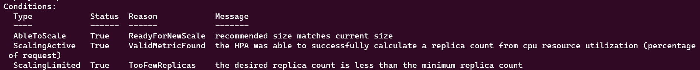

# Coding challenge

## Time spent

- Initial setup: ~40min
- App setup: ~15min

**Sub-total setup: 55min**

- Logging: 90min
- HPA: 50min
- Templating: 44min
- Rollback: 20min
- Metrics: tbd
- CI/CD tool choice: tbd

**Sub-total challenges: tbd**

> Please keep in mind, that while some timestamps or uptimes in the screenshots and elsewhere might suggest, that I took way longer
> for the tasks than I indicated above, but I did take breaks in between and didn't finish it all in one sitting 😉


## Step 0.1: Creating Kubernetes cluster

I choose [kind](https://kind.sigs.k8s.io/) for my local cluster, because of it's simplicity and configurability, which might come in handy later on.

You can find the configuration used for the cluster in [./kind/config.yaml](kind/config.yaml).

## Step 0.2: Deploying monitoring solution

Prometheus and Grafana are set as requirements and the easiest way to deploy both and all the extra components needed for a comprehensive monitoring solution is the [kube-prometheus-stack Helm chart](https://github.com/prometheus-community/helm-charts/tree/main/charts/kube-prometheus-stack).

It also comes with the [Prometheus operator](https://github.com/prometheus-operator/prometheus-operator) origianlly developed at CoreOS, which will make integrating the demo application later on just a bit easier, thanks to its `Pod`- and `Servicemonitor` CRDs.

You can find the `values.yaml` used for the installation [here](k8s/helm/prometheus-operator/values.yaml).

Once the monitoring stack is running, execute

```bash
kubectl --context=kind-coding-challenge-cluster --namespace=monitoring port-forward services/monitoring-grafana 8080:80
```

and visit [http://localhost:8080](http://localhost:8080) to access Grafana.

The credentials are **admin:prom-operator**.

## Step 0.3: Creating a Helm chart for the demo application

Since the challenge calls for all deployments to use some kind of templating, I am going to use `kustomize` for the demo application.
There are two reasons for this decision:

1. To introduce some varity into the project.
   Alot of the things I will deploy during this challenge are going to use Helm, so why not keep it interesting?
2. It is a very simple app.
   The app doesn't need a lot to work, so why overcomplicate?

I generated the deployment and the service with their respective `kubectl create` commands:

```bash
$ kubectl create deployment --image=gcr.io/kuard-demo/kuard-amd64:blue --dry-run=server --namespace=app --port=8080 --replicas=1 kuard -oyaml > k8s/manifests/deployment.yaml

$ k create service clusterip --dry-run=server --namespace app --tcp=8080:80 kuard -oyaml > service.yaml  
```

Then, I stripped out the unnecessary (runtime) bits such as `uid`, `creationTimestamp` and `status: {}` and added them to the kustomize directory.

I then added a lable to tie the service and the pod resulting from the deployment together and used the *image transformer* to manage the image in the `kustomization.yaml` file.

You can find the demo application files [here](k8s/kustomize/kuard).

Once the app is running, execute

```bash
kubectl --context=kind-coding-challenge-cluster --namespace=app port-forward services/kuard 9090:80
```

and visit [http://localhost:9090](http://localhost:9090) to access the demo app.

With the setup out of the way, I can start with the first challenge! 🎉

## Challenge 1: Logging

The first question is, what a logging solution could look like in a Kubernetes environment.

Having Grafana as a requirement and me having previous expirience with it, made picking [Grafana Loki](https://grafana.com/docs/loki/latest/) in combination with [Grafana Promtail](https://grafana.com/docs/loki/latest/clients/promtail/) a no-brainer.

The idea behind it is quite simple:
- Use Loki as the aggregation tool ("Like Prometheus, but for Logs!" (verbatim from the Loki logo))
- Use Promtail as the collection agent

The difference between Loki and Prometheus is, that Loki uses a *push* rather than a *pull* model. Where Prometheus polls each endpoint,
Promtail collects all logs from the containers *stdout* and *pushes* them to Loki.

Well, technically, Promtail scrapes the logs of the containers from the hosts filesystem. That's the reason, why Promtail mounts both `/var/lib/docker/containers` and `/var/log/pods` from the host machine.

So in essence:

container --logs--> stdout --*--> /var/log/pods <-- Promtail --> Loki <--query-- Grafana 

> \* I am guessing this is done by the kubelet, but I am not entirly sure here

Installing both components is rather straight-forward:
- Customize the `values.yaml` file shipped with the Helm chart
- Look up some configuration options
  I was at first a bit confused, how I can tell the Helm chart to install Loki in single-binary mode, but discovered, that it does that
  on its own, once you tell it to use the filesystem for storage (https://grafana.com/docs/loki/latest/installation/helm/configure-storage/)
- Install the Helm chart

After that is done, we can be happy, that all the pods are starting up correctly:


And we can even see logs, once Loki is configured as a datasource in Grafana:


Now this is well and good, but I don't want to configure the Grafana datasource everytime I reinstall it or Grafana is restarted.
Luckily, the Grafana Helm chart (part of the kube-prometheus-stack Helm chart) comes with a handy sidecar container enabling me to
define a datasource in a configmap and the sidecar then updates Grafana during runtime using the API.

All we need to add to the `values.yaml` of the Helm chart is:

```yaml
grafana:
...
additionalDataSources:
    - name: Loki
      type: loki
      access: proxy
      url: http://logging.logging.svc.cluster.local:3100
      jsonData:
        maxLines: 1000
```

and now, even after deleting the Grafana pod:


the datasource is still there:


## Challenge 2: Autoscaling

To be honest, this challenge had me stumped for a moment. The way it is phrased had my mind going towards load-testing, but I couldn't
really think of a Kubernetes native way to implement something like that aside from creating a Job/Pod that would just fire as many
HTTP requests as it could. But that would neither assure an application can handle high real-world loads, nor would it be a particular
meaningful test.

But then the assure had me going towards autoscaling and particularly `Horizontal Pod Autoscaling` (aka. HPA).

So I went in that direction and hope this satisfies the challenge.

Implementing a rudimentary autoscaling setup is - again - really straight forward:

1. Create an HPA resource using the built-in kubectl command:
  
  ```bash
  kubectl autoscale --namespace app deployment kuard --min 1 --max 10 --cpu-percent=80 --name=kuard --output yaml --dry-run=client > k8s/kustomize/kuard/hpa.yaml
  ```
   > It wouldn't let me do the server-side render (`--dry-run=server`) for some weird reason and just quite with:
   > `error: /, Kind= doesn't support dryRun`
   > So I just went with the client-side render and that worked
2. Add it to the kustomize directory and add it to the `resources` array in the `kustomization.yaml`
   > Kustomize has a built-in `nameReference` for Deployment -> HorizontalPodAutoscaler, which keeps them linked together

I went with `cpuPercentage` as the auto-scaling metric, since HTTP requests to stateless applications - in my experience - usually
are more CPU than Memory heavy. In a more sophisticated autoscaling setup, this could be tweaked in two main ways:

1. Use a custom metric like HTTP requests rate, or average response time
2. Go further with the autoscaling and implement a *cluster-autoscaler*, since the applications capacity is currently limited by the
   size of the cluster

And, of course, I forgot about the tiny detail, that a metrics based autoscaler actually needs metrics:


But that is easily fixed by providing an implementation for the Kubernetes metrics API. There are two, that I am currently aware of:

1. [Kubernetes SIG Metrics server](https://github.com/kubernetes-sigs/metrics-server)
2. [Kubernetes SIG Prometheus adapter](https://github.com/kubernetes-sigs/prometheus-adapter)

Both would work, but I think it is easiest when all metrics used by a system have a single source of truth. So I am going with the *Prometheus adapter*, which uses Prometheus as its datasource and converts those metrics to the Kubernetes metrics API format.

The great Prometheus community maintains a Helm Chart for it, so I am going to use that to install it.

After installing it and testing it, I noticed, that the HPA still wasn't picking up any metrics. After a quick look into the documentation on how to configure it, I noticed, that I forgot to add the config for the `pod.metrics` API.

What had me worried was, that after that fix `kubectl top` was still showing me `0m` CPU load for the app:


Guessing there was something wrong with my Prometheus setup, I quickly did a `kubectl top` on the Grafana pod:


which, to my great relieve, showed me, that everyting was working as intended, but the demo app just has a redicliously low CPU utilization.

And now, after checking the HPA again:


everything was working as intended! 😄

## Challenge 3: Templating issues

How one can spot issues with templating, actually depends on what one considers as an issue. This is an interesting question and has
many ways to go about this.

### Syntactical errors

Depending on the templating tool used, these are generally easy to spot before an application is deployed.

**Kustomize** is straight forward here. It will spot YAML format errors (wrong indentation manly) and will complain, if it can't accumulate all resources. This should cover the basic errors in how the Kustomize structure is setup and if the resources are formatted correctly.

**Helm** has similar possibilities. It comes with a `lint` sub-command, which generally spots most issues in the templating of a chart.
It also has a `dry-run` capability, with which I can assure, that the chart actually renders to something resembling a Kubernetes manifest.

### Manifest validation

Neither tool actually makes sure, that what it produces are valid Kubernetes Manifests. I can use a tool like [kubeconform](https://github.com/yannh/kubeconform) (which is inspired by `kubeeval`) to make sure, that all manifests a templating tool produces are actually valid Kubernetes manifests. It does that, by comparing all generated manifests (optained by either doing a `kustomize build` or a `helm template`) to their respective OpenAPIv3 specs. You can even extend these specs with the ones for CRDs to cover all manifests.

[Pluto](https://github.com/FairwindsOps/pluto) can also help to spot soon to be deprecated APIs early enough, before they are removed from Kubernetes.

At this point, we have validated, that the Helm chart / Kustomize config will produce valid, appliable Kubernetes manifests.

### Best practices

If we want to take this one step further, we can also check for common best-practices.
[kube-score](https://github.com/zegl/kube-score) can provide common best-practices for a lot of Kubernetes resources.

This way, we can catch stuff like not set resource limits/requests, missing probes, Statefulsets without a headless service and many more, before the application ever gets deployed.

Another way to go about this is with policies. Tools like [Datree](https://www.datree.io/) can check manifests against policies defined in a Kubernetes cluster, before they are deployed.
These tools are most often combined with `ValidatingWebhooks`, which block misconfigured deployments at deploy-time.

### Implementation

Since the challenge actually calls for an implementation and I am going to focus on `kubeconform` and `kube-score`.
You can find the implementation in [the Kustomize directory](k8s/kustomize/kuard/check.sh).

After changing the `containerPort` in the deployment from a number to a string, `kubeconform` complained about it:


And `kube-score` actually found quite alot of infringements:


Damn 😑. Let's fix those.

After fixing these failures, `kube-score` is happy again:


> To be honest, I did ignore three quality gates: Regarding PodDisruptionBudget, NetworkPolicy and PodAntiAffinity
> since they don't usefully apply to the demo use-case.

### Honorable mentions

[Kubernetes Pod Security Admission](https://kubernetes.io/docs/concepts/security/pod-security-admission/) can help secure pods,
by warning / enforcing security best-practices defined by the Kubernetes maintainers on a namespace level.
This doesn't really fit the challenge, since this is only effective at deploy-time.

## Challenge 4: Rollback

I just noticed, that I am running a bit out of time here, so I am going to try to keep my answeres a bit more precise and to the point.

The idea here is, if I rollout a new version of an app and notice something is wrong with the new version, I want to roll back to the previouse version.

There are again multiple ways to go about this:

- Kubernetes has a built in feature, that a Deployment keeps (by default) the last ten Replicasets.
- Helm keeps all previously applied configurations of a release in secrets, so you can always to a `helm rollback` to a specific revision
- You can employ more sophisticated deployment approaches such as Blue/Green deployments or canary releases.
  Depending on their implementation, they use one of the machanisms described above to enable the user to switch between two versions
  deployed simultaneously

Since I am using kustomize to deploy the app, I am going to use the built-in Kubernetes way of doing it.

First, we check the rollout history for the deployed app:


Then we apply our change in version:


We can see, that the pod was updated:


Now we can do a rollback (or more accurately a `rollout undo`):


We can check, that the old Replicaset was scaled up again: 


And see, that a new (old) pod was created:


